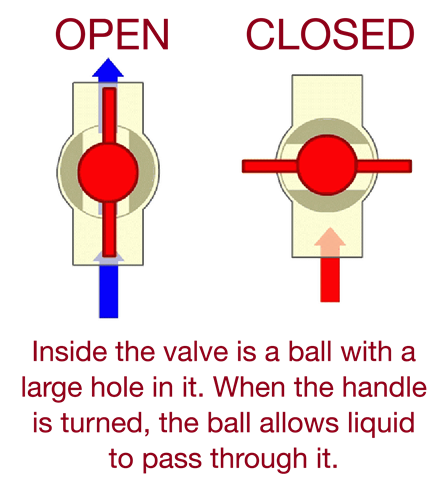
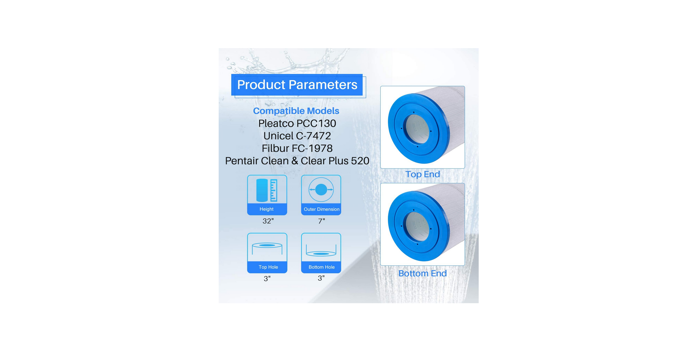

# Underground pool notes

This can be downloaded by clicking `Code >> Download zip`

## Removing the Main Filter

1. Turn off power (two switches)
2. Close the 4 valves (two Incoming, two Outgoing)
3. Open air valve on top of main filter
4. Visually inspect filter attached to pump, clean if necessary
5. Remove large the ring
6. Separate the filter body
7. Remove the filter cartridge while being mindful of the air escape tube
8. Clean and inspect filter cartridge
9. Reinstall the filter making sure that it seats into the lower portion, rotating can help seat it
10. Replace the top housing making sure that it is fully pressed into the bottom housing and is level
11. Tighten the ring hand tight
12. Open the form main valves
13. Turn the power on andd turn the pump on
14. Close the air valve once a steady stream of water is coming out
15. Visually inspect for any leaking components/pipes

## Filter Cleaning

### Main filter cartridge (the tall one)

    Use low to moderate water pressure, work from top to bottom. Be careful not to break the bands that run around the filter as these keep the pleats separated.

    Visually inspect the filter to make sure there's no tears or any damage. The plates can be separated slightly to make sure there is no leftover debris, most debris will be towards the back of the pleat and may be difficult to remove.

### Filter Baskets

    The filter basket at the inlet (in the pool), will need to be cleaned the most often.

    The filter basket attached to the pump will need to be cleaned less often and can be visually inspected through the site glass attached to the pump

## Notes

    Remember to lubricate all seals and visually inspect them when reassembling. Check seals for cracks or signs of drying out, these can be easily replaced. Can be lubricated with Vaseline or any O-ring safe lubricant, more is better.

    Valves probably could be left open during cleaning, although it is preferable to close the valves as this allows you to check their operation and cycle them regularly to keep them moving.

    After initial cleaning pressure gauge indicated 10 psi

## Schedule

+ Inlet baskets every 2 - 4 weeks
+ Filter cartridge 3 - 6 months (The pressure gauge can be used to help determine exactly when it needs to be cleaned)
+ Pool floor as needed
+ pump basket every 6 months (or as needed)

## TODO

+ [ ] Add salt, it's probably low (99% pure mined salt, no iodine)
+ [ ] Test water sample
+ [ ] Test robots
+ [ ] Test chlorine generator
+ [ ] Test chlorine generator controller
+ [ ] Adjust time on pump controller
+ [ ] Configure schedule on pump controller
+ [ ] Run pump for several hours to cycle water in the pool as well as observe motor and equipment for leaks
+ [ ] Thorough clean of cartridge filter, And record pressure gauge reading
+ [ ] Check filter leading to chlorine generator
+ [ ] Check water on sidewalk near side discharge (maybe a leak?)

## Equipment

+ Chlorine generator: Aqua pure, APure700

+ Cartridge filter: 32x7" with 33 openings (Maybe, need to measure.)

